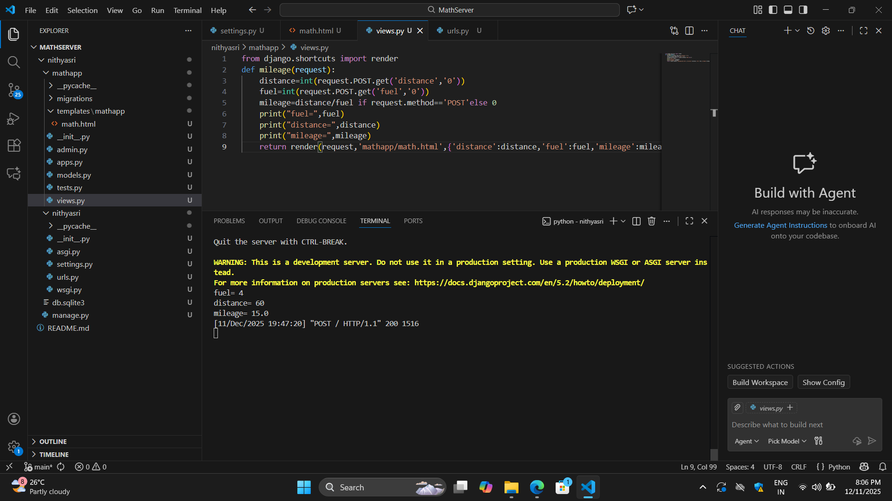
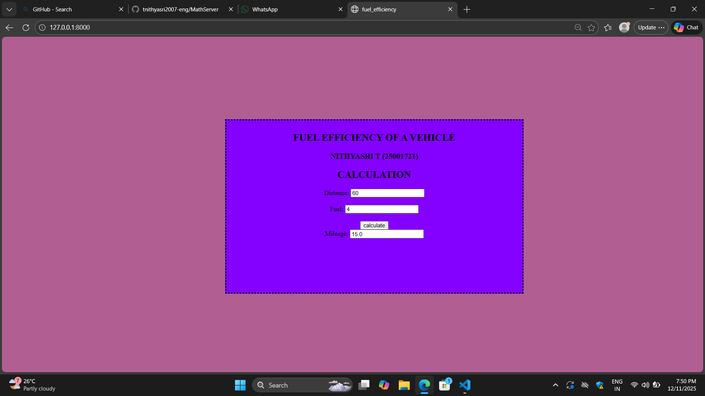

# Ex.04 Design a Website for Server Side Processing
## Date:
11/12/2025

## AIM:
To create a web page to calculate vehicle mileage and fuel efficiency using server-side scripts.

## FORMULA:
M = D / F
<br> M --> Mileage (in km/l)
<br> D --> Distance Travelled (in km)
<br> F --> Fuel Consumed (in l)

## DESIGN STEPS:

### Step 1:
Clone the repository from GitHub.

### Step 2:
Create Django Admin project.

### Step 3:
Create a New App under the Django Admin project.

### Step 4:
Create python programs for views and urls to perform server side processing.

### Step 5:
Create a HTML file to implement form based input and output.

### Step 6:
Publish the website in the given URL.

## PROGRAM:
```
math.html
<html>
    <head>
        <title>
            fuel_efficiency
        </title>
        <style>
            body
            {
               background-color: rgb(177, 94, 147); 
            }
            .box
            {
               width: 700px;
               height: 400px;
               background-color: rgb(132, 0, 255);
               border:dotted 4px black;
               padding: 8px;
               margin-left: 270px;
               margin-top: 100px;
               position:fixed;
               top: 100px;
               left: 270px; 
            }
        </style>
    </head>
    <body>
        <div class="box">
            <h2 align="center">FUEL EFFICIENCY OF A VEHICLE</h2>
            <h3 align="center">NITHYASRI T (25001721) </h3>
            <h2 align="center">CALCULATION</h2>
            <form method="POST" align="center">
                
                <label>Distance:</label>
                <input type="text" name="distance" value="{{ distance }}">
                <br>
                <br>
                <label>Fuel:</label>
                <input type="text" name="fuel" value="{{ fuel }}">
                <br>
                <br>
                <input type="submit" value="calculate">
                <br>
                <label>Mileage:</label>
                <input type="text" name="mileage" value="{{ mileage }}">
            </form>
        </div>
    </body>
</html>

views.py
from django.shortcuts import render
def mileage(request):
    distance=int(request.POST.get('distance','0'))
    fuel=int(request.POST.get('fuel','0'))
    mileage=distance/fuel if request.method=='POST'else 0
    print("fuel=",fuel)
    print("distance=",distance)
    print("mileage=",mileage)
    return render(request,'mathapp/math.html',{'distance':distance,'fuel':fuel,'mileage':mileage})

    urls.py
    from django.contrib import admin
from django.urls import path
from mathapp import views
urlpatterns = [
    path('',views.mileage,name='vehicle')
]
 
```


## OUTPUT - SERVER SIDE:



## OUTPUT - WEBPAGE:



## RESULT:
The a web page to calculate vehicle mileage and fuel efficiency using server-side scripts is created successfully.
